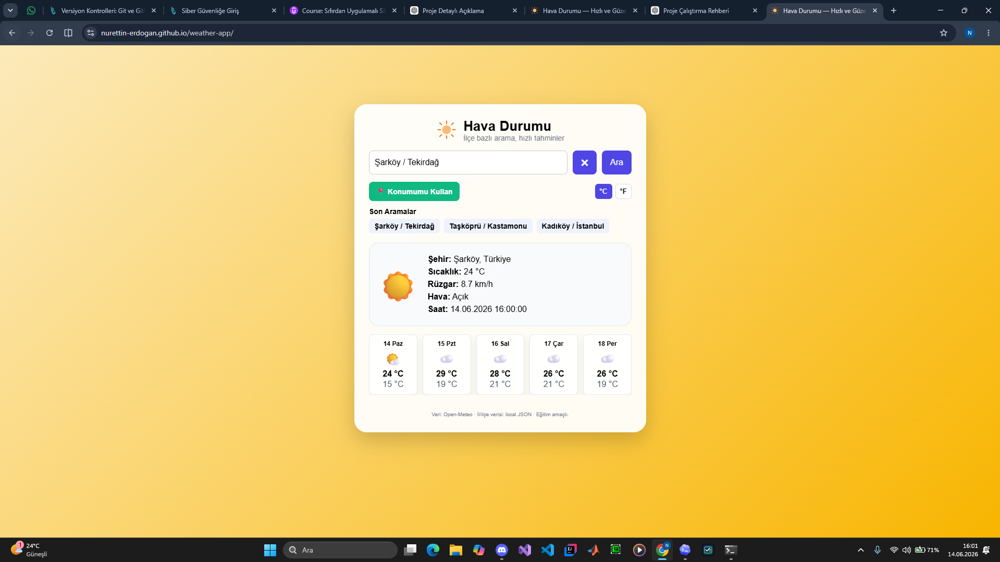

# Hava Durumu Uygulaması

Türkiye il ve ilçelerine göre anlık hava durumu ve 5 günlük tahmin gösteren basit, hızlı ve kullanıcı dostu bir web uygulamasıdır.

## Canlı Demo

Projeyi buradan görüntüleyebilirsiniz:

https://nurettin-erdogan.github.io/weather-app/

 
 
## Özellikler

* İl ve ilçe bazlı hava durumu arama
* Türkiye il/ilçe verisiyle hızlı local arama
* Anlık sıcaklık, rüzgar ve hava durumu bilgisi
* 5 günlük hava tahmini
* °C / °F sıcaklık birimi değiştirme
* Son aramaları kaydetme
* Konumumu kullan özelliği
* Hava durumuna göre değişen arka plan
* Mobil ve masaüstü uyumlu arayüz

 
## Ekran Görüntüsü



## Kullanılan Teknolojiler

* HTML
* CSS
* JavaScript
* JSON
* Open-Meteo API
* GitHub Pages

## Proje Yapısı

```text
weather-app/
├── index.html
├── style.css
├── app.js
├── data/
│   ├── il-ilce.json
│   └── il-ilce-with-loc.json
├── scripts/
├── README.md
└── favicon.svg
```

## Nasıl Çalıştırılır?

Projeyi bilgisayarda çalıştırmak için proje klasöründe terminal açıp şu komutu kullanabilirsiniz:

```bash
python -m http.server 8000
```

Sonra tarayıcıdan şu adrese gidin:

```text
http://localhost:8000
```

## Veri Kaynakları

Hava durumu verileri Open-Meteo API üzerinden alınmaktadır. İl ve ilçe bilgileri local JSON dosyaları üzerinden kullanılmaktadır.

## Geliştirme Notları

Bu proje eğitim amacıyla geliştirilmiştir. Amaç; HTML, CSS, JavaScript, API kullanımı, JSON veri işleme ve GitHub Pages ile yayınlama konularını pratik etmektir.
