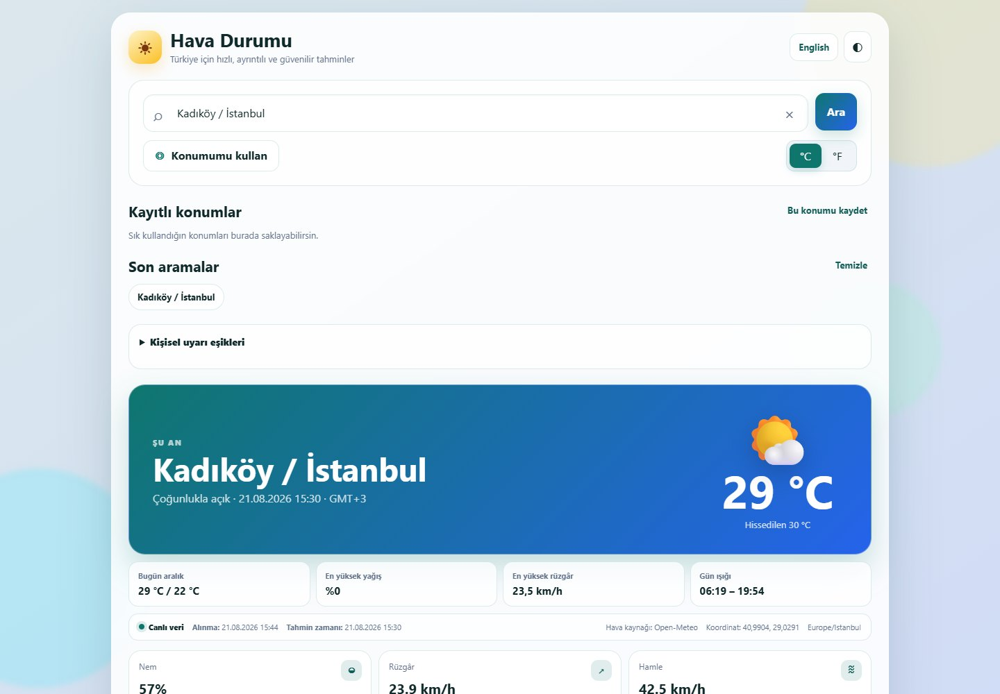

# Türkiye Hava

<p align="center">
  
</p>

<p align="center">
  <a href="https://github.com/Nurettin-Erdogan/weather-app/actions/workflows/ci.yml"></a>
  <a href="https://github.com/Nurettin-Erdogan/weather-app/actions/workflows/codeql.yml"></a>
  <a href="LICENSE"></a>
  <a href="https://turkiye-hava-pwa.vercel.app"></a>
</p>

**Türkiye genelinde 973 ilçe için hava tahmini, hava kalitesi ve çevrimdışı son tahmin erişimi sunan gizlilik odaklı PWA.**

Türkiye Hava; Open-Meteo ve OpenStreetMap tabanlı servisleri kullanan, kurulum gerektirmeden tarayıcıdan çalışan ve istenirse cihaza kurulabilen bir Progressive Web App'tir. Konum, önbellek, erişilebilirlik ve veri güncelliği uygulamanın temel mühendislik odaklarıdır.

<p align="center">
  <a href="https://turkiye-hava-pwa.vercel.app"><strong>Canlı demoyu aç →</strong></a>
  &nbsp;·&nbsp;
  <a href="docs/demo-guide.md"><strong>Demo rehberi</strong></a>
  &nbsp;·&nbsp;
  <a href="#test-ve-kalite"><strong>Testler</strong></a>
  &nbsp;·&nbsp;
  <a href="#veri-ve-gizlilik"><strong>Gizlilik</strong></a>
</p>

<p align="center">
  
</p>

## Kısa özet

| | |
| --- | --- |
| **Kapsam** | Türkiye'deki 973 ilçe |
| **Tahmin** | Anlık durum, saatlik görünüm, 7 günlük tahmin |
| **Ek veriler** | Hava kalitesi, UV, gün doğumu/batımı, yağış ve rüzgâr |
| **PWA** | Kurulabilir uygulama, service worker, çevrimdışı son tahmin |
| **Konum** | Kullanıcı onaylı GPS ve isteğe bağlı yaklaşık IP konumu |
| **Gizlilik** | Hesap yok, API anahtarı yok, tercihler cihazda tutulur |
| **Erişilebilirlik** | Klavye kullanımı, erişilebilir veri tablosu, mobil/masaüstü arayüz |
| **Kalite** | Playwright senaryoları, veri doğrulama testleri, CI ve CodeQL |

## Öne çıkan özellikler

### Tahmin ve günlük kullanım

- Anlık sıcaklık ve hissedilen sıcaklık
- 24 saatlik sıcaklık / yağış görünümü
- 7 günlük tahmin
- Nem, bulutluluk, yağış, rüzgâr yönü ve rüzgâr hamlesi
- Avrupa Hava Kalitesi İndeksi, PM2.5 ve PM10 ayrıntıları
- Anlık ve günlük maksimum UV
- Gün doğumu ve gün batımı
- Celsius / Fahrenheit seçimi
- Türkçe ve İngilizce arayüz
- Açık / koyu tema
- En fazla sekiz kayıtlı konum ve varsayılan konum seçimi
- Kayıtlı konumları tek ekranda karşılaştırma

### PWA ve çevrimdışı deneyim

- Kurulabilir PWA
- Son başarılı tahmini çevrimdışı açabilme
- Service Worker ile uygulama kabuğu önbelleği
- Kullanıcı onayıyla etkinleşen PWA güncellemesi
- Bağlantı geri geldiğinde sessiz yenileme
- Son aramaları, son açılan konumu ve tercihleri cihazda saklama
- Bozuk / geçersiz yerel veride güvenli varsayılanlara dönüş

### Konum ve gizlilik

- GPS yalnızca kullanıcı isteğiyle çalışır
- Yaklaşık IP konumu için ayrıca açık onay istenir
- GPS koordinatları Open-Meteo ve ters konum çözümleme için Photon'a gönderilir
- Türkiye dışındaki GPS konumları güvenle reddedilir
- Konum izni reddedilirse IP servisi otomatik çağrılmaz
- Kullanıcı hesabı ve sunucuda profil verisi yoktur
- Tercihler ve kayıtlı konumlar `localStorage` içinde tutulur
- Üçüncü taraf isteklere sayfa adresi referrer olarak gönderilmez

## Teknik mimari

```text
Kullanıcı
  ├─> İl / ilçe arama
  ├─> GPS (isteğe bağlı)
  └─> Yaklaşık IP (açık onayla)
        │
        ├─> Open-Meteo Forecast API
        ├─> Open-Meteo Air Quality API
        └─> OpenStreetMap / Photon
              │
              └─> Vanilla JS arayüz
                    ├─> Service Worker
                    ├─> localStorage
                    └─> PWA manifest
```

## Teknolojiler

- Vanilla JavaScript ve ES modules
- HTML / CSS
- Progressive Web App, Service Worker ve Web App Manifest
- Open-Meteo Forecast + Air Quality API
- OpenStreetMap tabanlı Photon reverse geocoding
- `localStorage`
- Playwright tabanlı tarayıcı testleri
- GitHub Actions CI
- CodeQL
- Vercel

## Mühendislik kararları

- **973 ilçe için yerel koordinat seti:** Kullanıcı aramasını dış geocoding servisine tamamen bağımlı bırakmadan hızlı eşleme sağlar.
- **Aynı isimli ilçelerde il doğrulaması:** Yanlış konum seçimini azaltır.
- **Konumda açık izin:** GPS ve yaklaşık IP akışları otomatik tetiklenmez.
- **Çevrimdışı modda eski veri ayrımı:** Offline kullanım yeni tahmin üretmez; yalnızca son kaydedilen veriyi gösterir.
- **Güvenli önbellek dönüşü:** Bozuk veya Türkiye dışı önbellek verileri kabul edilmez.
- **Kullanıcı kontrollü PWA güncellemesi:** Açık sekmeyi zorla yenilemek yerine yeni sürüm kullanıcıya bildirilir.
- **Erişilebilir veri sunumu:** Canvas grafik yanında açılabilir saatlik veri tablosu da bulunur.

## Risk özeti

Uygulama; önümüzdeki 24 saat için fırtına, kuvvetli yağış, kar, rüzgâr, sıcaklık, don, UV ve hava kalitesi verilerinden otomatik bir risk özeti üretir.

Bu özet **resmî meteorolojik uyarı değildir**. Kritik durumlarda Meteoroloji Genel Müdürlüğü ve ilgili resmî kurumların duyuruları esas alınmalıdır.

## Veri ve gizlilik

- GPS konumu yalnızca kullanıcı butona bastığında istenir.
- Koordinatlar hava verisi için Open-Meteo'ya, idari konum çözümlemesi için Photon'a gönderilir.
- Yerel listede bulunamayan arama metni eşleştirme amacıyla Open-Meteo geocoding servisine gönderilebilir.
- Yaklaşık IP konumu yalnızca açık onayla ve `ipwho.is` üzerinden alınır.
- Tercihler, kayıtlı konumlar, son aramalar ve son tahmin cihaz üzerinde tutulur.
- Uygulamada API anahtarı veya kullanıcı hesabı yoktur.

## Bir dakikada dene

1. [Canlı uygulamayı aç](https://turkiye-hava-pwa.vercel.app).
2. Bir ilçe ara; aynı isimli ilçelerde ili seç.
3. Günlük kartlardan birini açarak saatlik tahmini incele.
4. Bir tahmin yüklendikten sonra bağlantıyı kesip son kaydedilen tahmini aç.
5. Tema, dil, birim veya kayıtlı konum özelliklerini değiştirip sayfayı yeniden aç.

## Yerel çalıştırma

```bash
python -m http.server 8000 --bind 127.0.0.1
```

Ardından `http://127.0.0.1:8000` adresini açın.

Windows'ta `launch-local.bat` dosyası sunucuyu ve tarayıcıyı otomatik açar.

> `file://` üzerinden doğrudan açmayın; ES modülleri ve Service Worker için HTTP gerekir.

## Test ve kalite

```bash
python -m pip install -r requirements-dev.txt
python -m playwright install chromium
python -m unittest discover -s tests -p "test_*.py" -v
```

Test paketi özellikle şunları doğrular:

- 973 koordinatın Türkiye sınırları içinde olması
- İller arasında yanlış ortak koordinat bulunmaması
- Aynı isimli ilçelerde il seçiminin zorunlu olması
- Doğru koordinatın hava API'sine gönderilmesi
- Türkiye dışındaki GPS konumlarının reddedilmesi
- IP servisine açık onay olmadan istek gönderilmemesi
- Arama, birim, dil, tema ve mobil görünüm akışları
- API hata / yeniden deneme davranışı
- Bozuk `localStorage` ve hava önbelleğinde güvenli dönüş
- PWA önbellek sürümü ile HTML varlık sürümlerinin eşleşmesi
- Veri kaynağı ve güncellik bilgilerinin görünür olması
- Kayıtlı ve varsayılan konumların yeniden açılışta geri yüklenmesi
- Otomatik risk özetinin resmî uyarı olmadığını belirtmesi

## Üretim dağıtımı

Canlı sürüm: [turkiye-hava-pwa.vercel.app](https://turkiye-hava-pwa.vercel.app)

Kök dizindeki `vercel.json`; CSP, clickjacking, MIME sniffing, referrer ve tarayıcı izin başlıklarını HTTP katmanında uygular. GitHub Pages dağıtımı yedek ayna olarak kullanılabilir.

## Veri bakımı

Koordinat veri setini denetlemek için:

```bash
python scripts/repair_coordinates.py
python scripts/repair_coordinates.py --apply
```

Release paketi oluşturmak için:

```bash
python scripts/build_release.py
```

## Proje yapısı

```text
weather-app/
├── index.html
├── style.css
├── app.js
├── service-worker.js
├── manifest.webmanifest
├── js/
│   ├── api.js
│   ├── chart.js
│   ├── i18n.js
│   ├── search.js
│   ├── storage.js
│   ├── theme-init.js
│   ├── utils.js
│   ├── weather-alerts.js
│   └── weather-codes.js
├── data/il-ilce-with-loc.json
├── docs/
├── scripts/
└── tests/
```

## Veri kaynakları

- Tahmin ve geocoding: Open-Meteo
- Hava kalitesi: Open-Meteo Air Quality API
- GPS reverse geocoding: OpenStreetMap tabanlı Photon
- Yerel koordinat temel kaynağı: BuNick Turkey Cities & Districts

## English

**Türkiye Hava** is a privacy-minded Progressive Web App covering 973 Turkish districts. It provides current conditions, hourly and 7-day forecasts, air quality, installable PWA support and offline access to the last saved forecast. The app uses Open-Meteo and OpenStreetMap-based Photon without requiring user accounts or API keys.

Live demo: [turkiye-hava-pwa.vercel.app](https://turkiye-hava-pwa.vercel.app)

## Lisans

Proje kaynak kodu [MIT Lisansı](LICENSE) ile lisanslanmıştır. `data/` içeriği ve kullanılan üçüncü taraf servisler kendi sağlayıcılarının koşullarına tabidir.
